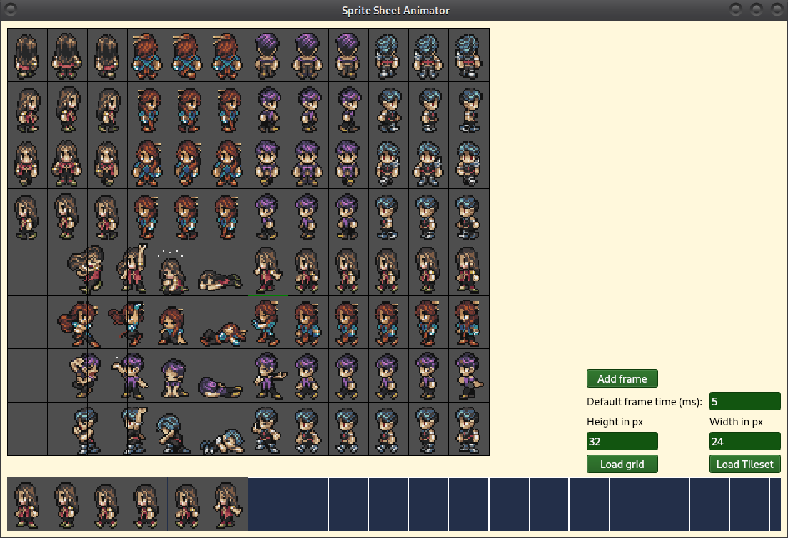

# sprite-sheet-animator

Currently in active development. Not accepting pull requests until first release is complete.\n
Animate sprites and save to json. \n
This is meant to configure an animation based on a sprite sheet. Then save the information; like time between frames and which frames to display into a JSON data structure so that you can allow someone to help you animate characters. Or allow people to add in custom animations into your games without altering the source code (Mods perhaps).
- [x] Create basic user interface
- [x] load and scale image
- [x] configure tile size and draw grid
- [] add other configuration options to ui.
- [] select tiles to put in animation
- [] rearrange frames
- [] add time in between frames
- [] allow frames to be tagged
- [] export animation information to a json data structure
- [] preview animation in tool

# Beyond scope for now but might be done in the future.
- [] allow scaling animations
- [] add layers to animate two frames at the same time (Like a hat)

# Build instructions for non vscode users.
`npm install` \
`npm run build` \
`./node_modules/.bin/qode ./dist/index.js` \
\
Alternatively you can use the launch.json if using vscode.
`npm install`
Then just hit F5

# Credits
BattoJutsu - Programming Source code under [AGPLV3 License](LICENSE) \
Joseph Seraph - for Creating the Heros_01 Sprite sheet used in example screenshot - CC-BY 3.0 [License Link](https://github.com/Battojutsu/f_engine/blob/master/src/resources/sprites/Heroes_01/LICENSE)